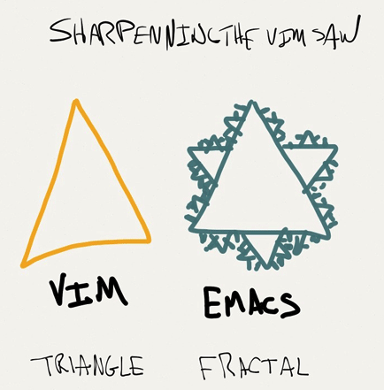
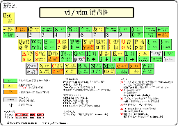
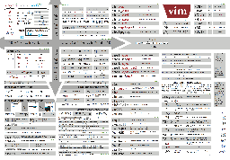

# Vim Practice [ ](https://creativecommons.org/licenses/by-nc-sa/4.0/deed.zh)


<!-- START doctoc generated TOC please keep comment here to allow auto update -->
<!-- DON'T EDIT THIS SECTION, INSTEAD RE-RUN doctoc TO UPDATE -->


- [0. 序](#0-%E5%BA%8F)
    - [0.1 `Vim` vs. `Emacs`](#01-vim-vs-emacs)
    - [0.2 关于编辑本身](#02-%E5%85%B3%E4%BA%8E%E7%BC%96%E8%BE%91%E6%9C%AC%E8%BA%AB)
- [1. 学习资料](#1-%E5%AD%A6%E4%B9%A0%E8%B5%84%E6%96%99)
    - [1.1 关于『学习』本身的规律](#11-%E5%85%B3%E4%BA%8E%E3%80%8E%E5%AD%A6%E4%B9%A0%E3%80%8F%E6%9C%AC%E8%BA%AB%E7%9A%84%E8%A7%84%E5%BE%8B)
    - [1.2 个人的`Vim`入坑路径](#12-%E4%B8%AA%E4%BA%BA%E7%9A%84vim%E5%85%A5%E5%9D%91%E8%B7%AF%E5%BE%84)
    - [1.3 文章/讨论](#13-%E6%96%87%E7%AB%A0%E8%AE%A8%E8%AE%BA)
    - [1.4 上手](#14-%E4%B8%8A%E6%89%8B)
    - [1.5 速查](#15-%E9%80%9F%E6%9F%A5)
    - [1.6 系统学习](#16-%E7%B3%BB%E7%BB%9F%E5%AD%A6%E4%B9%A0)
- [2. `Vim`配置/插件的资源](#2-vim%E9%85%8D%E7%BD%AE%E6%8F%92%E4%BB%B6%E7%9A%84%E8%B5%84%E6%BA%90)
    - [2.1 经典的配置必选版/插件站点](#21-%E7%BB%8F%E5%85%B8%E7%9A%84%E9%85%8D%E7%BD%AE%E5%BF%85%E9%80%89%E7%89%88%E6%8F%92%E4%BB%B6%E7%AB%99%E7%82%B9)
    - [2.2 经典插件介绍](#22-%E7%BB%8F%E5%85%B8%E6%8F%92%E4%BB%B6%E4%BB%8B%E7%BB%8D)
- [3. 分享视频及其笔记](#3-%E5%88%86%E4%BA%AB%E8%A7%86%E9%A2%91%E5%8F%8A%E5%85%B6%E7%AC%94%E8%AE%B0)
    - [3.1 Learning Vim in a Week](#31-learning-vim-in-a-week)
    - [3.2 7 Habits For Effective Text Editing 2.0](#32-7-habits-for-effective-text-editing-20)
        - [编辑器的选择](#%E7%BC%96%E8%BE%91%E5%99%A8%E7%9A%84%E9%80%89%E6%8B%A9)
        - [达到高效的3个基本步骤](#%E8%BE%BE%E5%88%B0%E9%AB%98%E6%95%88%E7%9A%843%E4%B8%AA%E5%9F%BA%E6%9C%AC%E6%AD%A5%E9%AA%A4)
        - [如何做到低效地编辑](#%E5%A6%82%E4%BD%95%E5%81%9A%E5%88%B0%E4%BD%8E%E6%95%88%E5%9C%B0%E7%BC%96%E8%BE%91)
- [4. 个人关心的问题](#4-%E4%B8%AA%E4%BA%BA%E5%85%B3%E5%BF%83%E7%9A%84%E9%97%AE%E9%A2%98)
    - [4.1 中文输入法在`Vim`便利切换的问题](#41-%E4%B8%AD%E6%96%87%E8%BE%93%E5%85%A5%E6%B3%95%E5%9C%A8vim%E4%BE%BF%E5%88%A9%E5%88%87%E6%8D%A2%E7%9A%84%E9%97%AE%E9%A2%98)
    - [4.2 `Vim`打开文件乱码问题](#42-vim%E6%89%93%E5%BC%80%E6%96%87%E4%BB%B6%E4%B9%B1%E7%A0%81%E9%97%AE%E9%A2%98)
    - [4.3 转换文件编码](#43-%E8%BD%AC%E6%8D%A2%E6%96%87%E4%BB%B6%E7%BC%96%E7%A0%81)
    - [4.4 `Vim`字体设置](#44-vim%E5%AD%97%E4%BD%93%E8%AE%BE%E7%BD%AE)
    - [4.5 查看所有的`Vim Map`](#45-%E6%9F%A5%E7%9C%8B%E6%89%80%E6%9C%89%E7%9A%84vim-map)
    - [4.6 `crontab -e`修改失败](#46-crontab--e%E4%BF%AE%E6%94%B9%E5%A4%B1%E8%B4%A5)
    - [4.7 `Vim`中文分词支持的问题](#47-vim%E4%B8%AD%E6%96%87%E5%88%86%E8%AF%8D%E6%94%AF%E6%8C%81%E7%9A%84%E9%97%AE%E9%A2%98)

<!-- END doctoc generated TOC please keep comment here to allow auto update -->



## 0. 序

### 0.1 `Vim` vs. `Emacs`

一上来就要说一个『宗教性』问题，很危险啊！ :smile: 这节不会说2个编辑器有什么不好，再者自己并不熟悉`Emacs`，只说自己了解到的一点感觉。

> `Vim`和`Emacs`：编辑器之神和神的编辑器。 :performing_arts:

上面的这句调侃不重要，重要的是效率:heavy_exclamation_mark:

个人没入`Emacs`圈，牛掰编辑器先入的是`Vim`。自己作为一个`Emacs`圈外人，对于两者对比的感觉是：

- `Vim`，从 **_编辑理念_** 出发并思考很深，通过面向编辑的语言进而脚本化/编程化的能力实现平台化。
	- 契合了 **_编辑器之『神』_** 的说法。
	- `Vim`提供了一套面向编辑的语言：
		- `diw`：`delete in word`，删除光标所在单词；`dd`：删除行（重复命令是对行操作）。
		- `x`：删除一个字符，`5x`：重复5次删除字符（即删除5个字符）。
		- 一旦你熟悉习惯这门语言，编辑的过程 就是 思考的过程。
		- 另外，这门语言本身就是可编程的（即编程语言），像上面用数字表示命令的重复执行次数，以及可以用`norm`命令或是宏把指令脚本化。这里不展开了。
- `Emacs`，**_平台理念_** 很深，以平台化思路承载和带动编辑理念。
	- 契合了 **_『神』的编辑器_** 这个说法。只要你喜欢可以把`Emacs`打造成`Vim`，当然`Emacs`也提供一套自己编辑风格，基于组合快捷键，现在各种软件都提供快捷键来加速操作，尤其是程序员的`IDE`更是重度依赖熟练的使用快捷键。
	- 关于`Emacs`的平台特质可以看看文章：
		- [程序员的编辑器 —— `Vim`](forwarded-articles/editor-for-programmer.md)，也提到了一点：  
			`vi`追求的是快捷——启动程序迅速，编辑文本高效，功能专注，而`Emacs`追求的是功能的丰富强大以及集成带来的方便，在`Emacs`里头可以发邮件，上新闻组，听`MP3`，浏览网页，玩游戏，几乎可以`login` -> `emacs` -> `logout`了 :-)，`vi`和`Emacs`都是程序员的编辑器，相比而言，`Emacs`更是提供了一种程序员的生活氛围。
		- [从`Vim`到`Emacs`到`Evil`](http://ceyes.github.io/2015-01/from-Vim-to-Emacs/)  
			`Emacs`只是个强大的平台，提供各种定制来满足每个人的不同需求。所以Thanks `Evil`，我已把`Emacs` 打造成了理想的『`Vim`化的`Emacs Editor`』，我可以纵情使用更方便的方式来工作。  
			这个思路已经被解决方案化了，即是[`spacemacs`](https://github.com/syl20bnr/spacemacs)，已经是最火的`Vim`/`Emacs`配置发行版了，我还一直没有去上手 :expressionless:，真是山外有山而学无止境啊～ :astonished:

### 0.2 关于编辑本身

人类智慧输出包含了『录入』和『编辑』操作。

目前，『键盘录入』/『键盘编辑』是主流方式。  
键盘操作效率的关键是『打字指法』/『盲打』。

对于录入，当然还有语音录入等等（期待脑电波的录入方式成为现实 :smile:）。  
对于中文，还多一样，即『输入法』，如五笔、拼音。

『编辑器』 对于 编辑 的重要性 不言而喻。

综上，智慧输出包含了：

1. 键盘操作：
	- 打字指法
1. 录入 => 键盘录入：
	- 输入法
1. 编辑 => 键盘编辑：
	- 编辑器

上面『打字指法』和『编辑器』的顺序重要的，如果你还不能 **_盲打_**，那么不要想着要找一个的编辑器就能高效了！ :dancers:

## 1. 学习资料


### 1.1 关于『学习』本身的规律

1. 学习一样新事物的先进，不在于刚开始看到的点，而在于理解 **_一整套_** 方法，整套方法背后蕴含体现的是理念。
1. 上手新事物必然先经历一个能力下降阶段，因为你要放弃你所熟悉的，重新接纳新的一套方法。
1. 有下面想法同学必然禁锢于原地踏步：
	- 不愿去理解理念（整套方法），而是用当前自己熟悉的技能点去比新事物的点。
	- 不愿接受上手新事物的学习成本和先要经历能力下降的一个阶段。

### 1.2 个人的`Vim`入坑路径

1. 看一下`Vim`整体评论性文章，觉得值得入门上手。  
	这点基本不是问题，`Vim`名声在外，问题其实是入门门槛。
1. 通过`vimtutor`，上手了解些基本操作。这时候心理上要注意：
	- 这只是了解基本，不要认为这一步可以在日常中方便的使用了。
	- 让自己可以在`Vim`环境生存下来。首先要避免为了退出`Vim`要去重启机器吧～   
		（:joy: 可以看看[Stack Overflow：帮助一百万开发者退出 Vim](https://zhuanlan.zhihu.com/p/27077076)）
1. 系统学习，边看[《`Vim`实用技巧 - 以思维的速度编辑文本》](http://book.douban.com/subject/25869486/)边操作，完成实践和理念储备。  
	这一步我保持一个相对慢速但持续的过程，两三周时间。
1. 配置上[`spf13-vim`](https://github.com/spf13/spf13-vim)发行版，舒适强大专业的`Vim`环境配置。  
	很多人不推荐这么做，去使用别人的一大套配置。我比较实用，避免大量配置打磨的时间投入，先接纳有心人的专业经验。中间会去填`spf13-vim`可能的一些坑。
1. 了解一些经典插件并逐个实战，如[`surround`](https://github.com/tpope/vim-surround)。

### 1.3 文章/讨论

- [Why `Vim` is awesome](http://federicoramirez.name/why-vim-is-awesome/)
- [`VIM` is awesome — But don’t overdo it](https://medium.com/@PhilPlckthun/vim-is-awesome-but-dont-overdo-it-c03594e6bb5b#.hyy2nhhe9)  
	过犹不及，再好的东西，也要明白什么时候不合适，这是反而说明是深的理解。
- [简明`Vim`练级攻略 - coolshell.cn](http://coolshell.cn/articles/5426.html) | 英文原文 [Learn `Vim` Progressively](http://yannesposito.com/Scratch/en/blog/Learn-Vim-Progressively/)  
	快速逐步上手介绍。
- [Coming Home to `Vim`](http://stevelosh.com/blog/2010/09/coming-home-to-vim/)  
	快速上手使用。为什么使用`Vim`/`Vim`使用感觉/上手的高效配置/好用的插件。
- [普通人的编辑利器 —— `Vim`](forwarded-articles/editor-for-mortal.md) / [程序员的编辑器 —— `Vim`](forwarded-articles/editor-for-programmer.md)  
	这2篇文章以普通用户/程序员的视角，短短一篇文章让你感受`Vim`的风格、能力和一致性设计。  
	以非系统学习方式，获得偏整体了解的好文章！
- [提高`Vim`使用效率的 12 个技巧](http://blog.jobbole.com/87481/)
- [Awesome `Vim` Plugins](https://reinteractive.net/posts/166-awesome-vim-plugins)
- 池建强的Blog：『谁说`Vim`不是`IDE`？』系列：
	- [1. 概述、编程人生、使用场景](http://www.cnblogs.com/chijianqiang/archive/2012/10/30/vim-1.html)
	- [2. 环境配置、基本概念](http://www.cnblogs.com/chijianqiang/archive/2012/10/31/vim-2.html)
	- [3. 常用插件](http://www.cnblogs.com/chijianqiang/archive/2012/11/06/vim-3.html)
- 知乎上的一些话题（看一下讨论扩展一下了解）
	- [有哪些编程必备的 `Vim` 配置？ - 知乎](https://www.zhihu.com/question/19989337)
	- [到底 `VIM` 能配置到多强大的程度？ - 知乎](https://www.zhihu.com/question/20151659)
	- [为什么不少程序员极度推崇 `Vim` 和 `Emacs`，却对 `IDE` 嗤之以鼻？ - 知乎](https://www.zhihu.com/question/21504638)
- `Emacs`的文章（能有瑜亮般的对手而相互竞争与学习，比起高处不胜寒的孤寂可以说是幸运！）
	- [从`Vim`到`Emacs`到`Evil`](http://ceyes.github.io/2015-01/from-Vim-to-Emacs/)  
		`Emacs`只是个强大的平台，提供各种定制来满足每个人的不同需求。所以Thanks `Evil`，我已把`Emacs` 打造成了理想的『`Vim`化的`Emacs Editor`』，我可以纵情使用更方便的方式来工作。
	- [_王垠_ 之《`Emacs`是一种信仰！世界最强编辑器介绍》](forwarded-articles/emacs-is-a-faith.md)

### 1.4 上手

- `vimtutor`

[](https://raw.githubusercontent.com/oldratlee/vim-practice/master/images/vi-vim-cheat-sheet-sch.gif)

### 1.5 速查

内容比较精简且有中文版的：

1. [`Vim` Cheat Sheet中文版 - vim.rtorr.com](http://vim.rtorr.com/lang/zh_cn/)
1. Graphical `vi`/`Vim` Cheat Sheet and Tutorial中文版（右图，点击看大图）  
	该图的[来源链接](http://blog.ngedit.com/vi-vim-cheat-sheet-sch.gif)，[官网](http://www.viemu.com/a_vi_vim_graphical_cheat_sheet_tutorial.html)中文版。 # 这张图你肯定在别人桌子上见过 :smile:

内容比较丰富的：

[](https://raw.githubusercontent.com/oldratlee/vim-practice/master/images/beautiful-vim-cheat-sheet.png)

1. Beautiful `Vim` Cheat-Sheet （右图，点击看大图）  
	\# 个人觉得这个是信息表达最好的一个！ :cupid::sparkling_heart: 该图的[来源链接](http://i.imgur.com/YLInLlY.png)，这个Sheet Cheat的[评论](https://www.reddit.com/r/vim/comments/32r85c/this_is_my_favorite_vim_cheat_sheet_does_anyone/)和[官网](http://vimcheatsheet.com/)。
1. [Cheat Sheet - michael.peopleofhonoronly.com](http://michael.peopleofhonoronly.com/vim/)

Cheat Sheet有几个就够用了，别多看了你～ 当然还有[更多Vim Cheat Sheet](more-cheat-sheet.md) :joy:

### 1.6 系统学习

1. `Vim` user manual/reference，即是`Vim`的内置帮助系统，内容丰富！！  
	中文版 <http://sourceforge.net/projects/vimcdoc/files/pdf-manual/>
	1. 学会用`Vim`的内置帮助 `:h` `:h 'option'` `:h command` `:h :ex_command` `:h ctrl-w`
	1. `Vim`帮助系统的帮助，即如何使用`Vim`的帮助系统： `:h helphelp`
1. 个人整理的 [`Vim`书籍豆列](http://www.douban.com/doulist/41500790/)
	1. 个人先看的是[《`Vim`实用技巧 - 以思维的速度编辑文本》](http://book.douban.com/subject/25869486/)  
		以编辑理念和实践模式为纲介绍，推荐之。  
		**_词句共灵感一射，编辑与思考齐飞！_**
	1. [《Learning the `vi` and `Vim` Editors》](http://book.douban.com/subject/3767413/)，行文稳健（很合我的风格）：
		1. 先介绍基本功能再说明如何组合技术，从熟悉到领会。
		1. 再介绍基本编辑器（`vi`/`ex`）再说明`Vim`，从历史发展的过程更能深入理解功能适用场景。
		1. 还介绍`vi`/`Vim`的周边信息，如`vi`/`Vim`的名家名言，各个变种，`vi`/`Emacs`的文化等等
1. [vim-galore - Everything you need to know about `Vim` ](https://github.com/mhinz/vim-galore) | [中文译文](https://github.com/wsdjeg/vim-galore-zh_cn)  
	`Vim`方方面面资料汇总。

## 2. `Vim`配置/插件的资源

### 2.1 经典的配置必选版/插件站点

- [`spf13-vim` - a distribution of `Vim` plugins and resources ](https://github.com/spf13/spf13-vim) - `Vim`的配置框架和配置集合。
	- 包含很多插件/主题，无论是小白还是高手，省时好用是王道，用起来。
	- 直接使用，配置的效果和包含的插件 已经很不错了。
	- `spf13-vim`首先是个`Vim`**配置框架**，水准尽显！
- [`Janus`: `Vim` Distribution ](https://github.com/carlhuda/janus)
	- 又一个`Vim`配置版本！
- [The Ultimate `vimrc` ](https://github.com/amix/vimrc) - Over the last 8 years I have used and tweaked Vim.
	- 作者 **_10年_** 在`Vim`配置上的积累。
	- 绝对值得参考学习！
	- 因为不是框架，所以我会选`spf13-vim`作为我的配置主方式。
- [Maximum Awesome ](https://github.com/square/maximum-awesome) - 三架马车`Vim`、`tmux`和`iTerm 2`的配置。
	- 值得参考！
- `Vim` + `Emacs` distribution（本人没有入`Emacs`圈子，作为广度了解一下）
	- [`spacemacs` - A community-driven `Emacs` distribution - The best editor is neither `Emacs` nor `Vim`, it's `Emacs` *and* `Vim`! ](https://github.com/syl20bnr/spacemacs) 
		- 能结合发挥出2大编辑器的优势，这个思路确实很屌！
		- 从这个项目`star`数也可见一斑！另外还要注意，[`spf13-vim`](https://github.com/spf13/spf13-vim)出来7年了（2010-04-20新建的仓库），而[`spacemacs`](https://github.com/syl20bnr/spacemacs)出来5年更短（2012-12-17新建的仓库）
	- [`SpaceVim` - A community-driven `vim` distribution inspired by `spacemacs`! ](https://github.com/SpaceVim/SpaceVim)
- [`Vim` Awesome - a comprehensive, accurate, and up-to-date directory of `Vim` plugins](http://vimawesome.com/)，`Vim`插件浏览站点

### 2.2 经典插件介绍

- `YCM`
	- [Welcome to world of `YCM`](plugin-intro/ycm-vim-plugin-intro.md)  
		由[@阳台](https://github.com/cp542524698)有爱贡献编写！

## 3. 分享视频及其笔记

### 3.1 Learning Vim in a Week

[Youtube视频地址](https://www.youtube.com/watch?v=_NUO4JEtkDw)，讲解了入门`Vim`时

- 观念上的改变/注意事项
	- 总有更好的做法
	- 学习`Vim`是个持续的过程，可以不断提高能力，进而逐步提升效率。
- 不要在平时的工作使用中开始学习`Vim`！因为 工作紧急需要的效率 与 `Vim`刚开始学习时摸索的低效 有矛盾！
- `Vim`命令记忆法

还给出实用的Tips：

1. `Hack`（定制）你的键盘
	- 通过[`Seil`](https://pqrs.org/osx/karabiner/seil.html.en)修改`Caplock`键成`ECS`键
	- 通过[`karabiner`](https://pqrs.org/osx/karabiner/)修改键盘重复前延迟和加速重复频率，以快速地在`Vim`中导航
1. [Graphical vi/Vim Cheat Sheet and Tutorial](http://www.viemu.com/a_vi_vim_graphical_cheat_sheet_tutorial.html)  
	中文版 <http://blog.ngedit.com/vi-vim-cheat-sheet-sch.gif>
1. `.vimrc` - 你的新朋友！
	- 一定要 **_版本控制_** 起来！
	- 可以偷借你朋友的配置文件（`dotfiles`），或是借鉴 <https://github.com/thoughtbot/dotfiles>
1. 通过官方的`vimtutor`定期适量的学习 / 通过游戏<http://vim-adventures.com/>来学习～
1. 通过看高手的操作视频方法来学习
	- [vimcasts.org](http://vimcasts.org/)
	- [upcase.com/vim](https://upcase.com/vim)

### 3.2 7 Habits For Effective Text Editing 2.0

[Youtube视频地址](https://www.youtube.com/watch?v=p6K4iIMlouI)，2007-02-13，`Vim`作者 **_Brian Moolenaar_** 在`Google`做的演讲，讲解了编辑器的选择、达到高效编辑的方法和理念。

#### 编辑器的选择

1. 如果你已经熟悉精通了一个编辑器，挺好的。这里不会讨论『`Vim`比`Emacs`更好』这个问题，但你可能会觉得`Emacs`并不爽～ :joy:
1. 但不要使用像`Notepad`这样简陋的编辑器，你浪费了大量的生命！ :astonished:
1. 要么用一个觉得的爽的编辑器，要么转用`Vim`吧～ :stuck_out_tongue_winking_eye: 除此再没有其它的出路！（_There is NO other RULE!_）

#### 达到高效的3个基本步骤

这部分的总结页：

1. 发觉低效
	- 发现你浪费时间的地方
2. 找到更快的方法
	- 阅读在线帮助
	- 阅读速查手册、书籍等等
	- 问问朋友或是同事
	- 搜索网络
	- 自己搞定
3. 使之成为习惯
	- 动手做起来
	- 持续改进

> 附原文：
>
1. Step 1: Detect inefficiency
	- Find out what you waste time on
1. Step 2: Find a quicker way
	- read the on-line help
	- read the quick reference, books, etc.
	- ask friends and colleagues
	- search the internet
	- do It yourself
1. Step 3: Make it a habit
	- do it
	- keep on improving

#### 如何做到低效地编辑

> @oldratlee 这是我最喜欢的一节 :joy:

- 必须立即开始编辑文本。没空去读文档或是学新的命令。  
	**_结果一直只会用原始的命令。_**
- 想学习编辑器提供的每一个功能，总是想用最快捷的命令。  
	**_结果是浪费大量的时间去学习从不会用到的内容。_**

> 附原文：
>
How **not** to edit effectively
- You have to get the text ready right now. No time
to read documentation or leam a new command.  
**_You will keep on using primitive commands._**
- You want to learn every feature the editor offers
and use the most efficient command all the time.  
**_You will waste a lot of time learning things you will never use._**

## 4. 个人关心的问题

欢迎高手指点！请提交[Issue](https://github.com/oldratlee/vim-pratice/issues)。

### 4.1 中文输入法在`Vim`便利切换的问题

**_问题说明：_**

本来`Vim`是有模式的（`Normal/Command/Insert/Replace/Visual/...`），再加上中文需要输入法切换（你处在中文输入还是英文输入状态），中文编辑需要在脑子记住当前是哪个状态的，个人觉得这很蛋疼。

理想的状态期望：

- 当切换到如`Normal/Command`模式时，自动切换到英文输入法。
- 切回到`Insert`模式时，还原文字输入时所用的输入法状态（中文输入/英文输入）。

**_解决方法：_**

解法参见[`@CodeFalling`](https://github.com/CodeFalling)的[完美解决 `Mac` 下 `Vim/Emacs` 的输入法切换问题](https://codefalling.com/2015/11/02/fcitx-vim-for-OS-X/)：

1. 安装配合工具[`fcitx-remote-for-osx`](https://github.com/CodeFalling/fcitx-remote-for-osx)
2. 安装`Vim`插件[`fcitx-vim-osx`](https://github.com/CodeFalling/fcitx-vim-osx)

PS: Thanks for your **_PERFECT_** works! [`@CodeFalling`](https://github.com/CodeFalling)

### 4.2 `Vim`打开文件乱码问题

**_问题说明：_**

`Vim`打开文件是乱码，常见的原因是编码识别错误。

**_解决方法：_**

可以在`.vimrc`配置文件中设置好`Vim`的用于尝试识别的编码序列，依次使用序列中的编码直到这个编码可以正确显示文件中的字符：

```vim
" 需要配置到 .vimrc 中
set fileencodings=ucs-bom,utf-8,gb18030,utf-16le,big5,euc-jp,euc-kr,latin1
```

如果仍然识别成乱码（比如文件包含多种编码的字符，一定会有乱码），可以在命令模式显式指定编码重新打开文件，命令如下：

```vim
" 用UTF8编码重新打开加载当前文件
:e ++enc=utf-8
" 用GBK编码重新加载
:e ++enc=gbk
" GB18030字符集是GBK的超集，为了方便键入使用GBK名
```

更多原因解析和处理方法参见[@滇狐](http://edyfox.codecarver.org/html/index.html)的文章[`VIM`文件编码识别与乱码处理](http://edyfox.codecarver.org/html/vim_fileencodings_detection.html)，讲得深入浅出、鞭辟入里！

PS:  
像`Vim`一样，字符编码也是一个很具计算机风味的话题，这里不解释，如果不清楚可以自己搜索研究一下。

### 4.3 转换文件编码

**_问题说明：_**

如题。

**_解决方法：_**

```vim
" 设置写文件时使用UTF8编码
:set fileencoding=utf-8
" 写文件（完成文件编码转换）
:w

" 为了方便键入，使用短选项名fenc并写成一行
:se fenc=utf8 | w

" 文件转换成GBK编码
:se fenc=gbk | w
" GB18030字符集是GBK的超集，为了方便键入使用GBK名

" 可以进一步在 .vimrc 中配置Mapping，省得繁琐的键入
nnoremap <Leader>eu :set fileencoding=utf-8 \| w<CR>
nnoremap <Leader>eg :set fileencoding=gb18030 \| w<CR>
```

参考资料： [How can I change a file's encoding with vim? - vi.stackexchange.com](https://stackoverflow.com/questions/778069)

### 4.4 `Vim`字体设置

**_问题说明：_**

合适字体可以方便识别，提高效率和心情，不能说不重要！ :kiss:

- 对在控制台中运行的`Vim`命令，字体由终端配置。
- `GUI Vim`由`Vim`自己来配置。

`Mac`下，终端常用的是`iTerm`/`terminal`应用，`GUI Vim`用的是`MacVim`应用。

**_解决方法：_**

详见单独一页的说明：[设置`Vim`字体](font-config/README.md)。

### 4.5 查看所有的`Vim Map`

**_问题说明：_**

下面的场景下，会想查看所有的`Vim Map`：

1. `Vim`可以定制自己命令，为了不重写已有的快捷键（`Map`）
1. 也看看想要功能是不是已经有`Map`了

**_解决方法：_**

```vim
redir > map.txt | silent map | redir END
" 如果文件已经存在加上!来覆盖输出的文件
redir! > map.txt | silent map | redir END
```

### 4.6 `crontab -e`修改失败

**_问题说明：_**

`crontab`修改后，报`crontab: temp file must be edited in place`出错信息，`crontab`没有修改。

```sh
$ crontab -e
# ... I do my thing in vim & :wq
"crontab.9ZcXiFaawt" 6L, 203C written
crontab: temp file must be edited in place
```

**_解决方法：_**

在`.vimrc`配置文件中设置，对于`crontab`文件不使用备份文件：

```vim
" 需要配置到 .vimrc 中
autocmd BufNewFile,BufRead crontab.* set nobackup | set nowritebackup
```

更多说明参见：

- [How do I edit crontab files with Vim (I get the error: 'temp file must be edited in place') - vi.stackexchange.com](http://vi.stackexchange.com/questions/137)
- [Using vim to edit crontab on Mac OS/X](https://jamiecook.wordpress.com/2013/02/10/using-vim-to-edit-crontab-on-mac-osx/)

### 4.7 `Vim`中文分词支持的问题

**_问题说明：_**

不像英文，中文的词的分离没有像空格这样明显分隔，词相关的移动变得很麻烦。

**_解决方法：_**

目前还 **_没有_** 找到解法。总得来说，这个问题不大，可以替代的做法：

- `Hack`/加速系统的按键重复后，可以简单地用`hjkl`在小/大范围内快速导航。
- 用词以外的方式也可以比较快地完成导航，如
	- 在大范围的按段跳、按页跳（`CTRL-D/CTRL-F`）。
	- 按搜索跳
		- `fz/Fz/tz/Tz`
		- `n/N`

`Vim`分词的相关资源

- [`Vim`与中文分词 - google group](https://groups.google.com/forum/#!msg/pongba/RXVqM4sKseU/TrCrySBH1HwJ)
- [`Vim`模式下能增加中文分词的支持么？](https://github.com/ghosert/cmd-editor/issues/103)
- [关于`Vim&Emacs`的中文分词相关讨论](https://biergaizi.info/archives/2012/04/1322.html)

　

-------------------------------

[](http://www.vim.org/buttons.php)
