原文链接： [普通人的编辑利器——`Vim`](http://blog.sina.com.cn/s/blog_46dac66f010005kw.html) 作者:[善用佳软](http://blog.sina.com.cn/m/xbeta)　版本:v1.5-r5-20080220，2006-12-04

普通人的编辑利器 —— `Vim`
====================================================

:point_right: 本文适合`Vim`新手，既可阅读入门，也可跟随本文一步步操作，动手体验。

---------------------------

<!-- START doctoc generated TOC please keep comment here to allow auto update -->
<!-- DON'T EDIT THIS SECTION, INSTEAD RE-RUN doctoc TO UPDATE -->


- [1 对`Vim`的基本介绍](#1-%E5%AF%B9vim%E7%9A%84%E5%9F%BA%E6%9C%AC%E4%BB%8B%E7%BB%8D)
- [2 下载和安装](#2-%E4%B8%8B%E8%BD%BD%E5%92%8C%E5%AE%89%E8%A3%85)
- [3 体验之旅](#3-%E4%BD%93%E9%AA%8C%E4%B9%8B%E6%97%85)
    - [3.1 初见界面](#31-%E5%88%9D%E8%A7%81%E7%95%8C%E9%9D%A2)
    - [3.2 试读`html`](#32-%E8%AF%95%E8%AF%BBhtml)
    - [3.3 改头换面](#33-%E6%94%B9%E5%A4%B4%E6%8D%A2%E9%9D%A2)
    - [3.4 准备并打开范例文件](#34-%E5%87%86%E5%A4%87%E5%B9%B6%E6%89%93%E5%BC%80%E8%8C%83%E4%BE%8B%E6%96%87%E4%BB%B6)
    - [3.5 统一格式，修改`vimrc`](#35-%E7%BB%9F%E4%B8%80%E6%A0%BC%E5%BC%8F%EF%BC%8C%E4%BF%AE%E6%94%B9vimrc)
    - [3.6 打开`test.txt`](#36-%E6%89%93%E5%BC%80testtxt)
    - [3.7 分段并保存](#37-%E5%88%86%E6%AE%B5%E5%B9%B6%E4%BF%9D%E5%AD%98)
    - [3.8 继续编辑](#38-%E7%BB%A7%E7%BB%AD%E7%BC%96%E8%BE%91)
    - [3.9 更多编辑](#39-%E6%9B%B4%E5%A4%9A%E7%BC%96%E8%BE%91)
        - [任务a：把每一句分为一行，即达到如下效果](#%E4%BB%BB%E5%8A%A1a%EF%BC%9A%E6%8A%8A%E6%AF%8F%E4%B8%80%E5%8F%A5%E5%88%86%E4%B8%BA%E4%B8%80%E8%A1%8C%EF%BC%8C%E5%8D%B3%E8%BE%BE%E5%88%B0%E5%A6%82%E4%B8%8B%E6%95%88%E6%9E%9C)
        - [任务b：把行末的标点去掉，即『荣』后的顿号和『耻』后的逗号](#%E4%BB%BB%E5%8A%A1b%EF%BC%9A%E6%8A%8A%E8%A1%8C%E6%9C%AB%E7%9A%84%E6%A0%87%E7%82%B9%E5%8E%BB%E6%8E%89%EF%BC%8C%E5%8D%B3%E3%80%8E%E8%8D%A3%E3%80%8F%E5%90%8E%E7%9A%84%E9%A1%BF%E5%8F%B7%E5%92%8C%E3%80%8E%E8%80%BB%E3%80%8F%E5%90%8E%E7%9A%84%E9%80%97%E5%8F%B7)
        - [任务c：错落有致](#%E4%BB%BB%E5%8A%A1c%EF%BC%9A%E9%94%99%E8%90%BD%E6%9C%89%E8%87%B4)
    - [3.10 自由体验](#310-%E8%87%AA%E7%94%B1%E4%BD%93%E9%AA%8C)
    - [3.11 体验语法高亮和折叠](#311-%E4%BD%93%E9%AA%8C%E8%AF%AD%E6%B3%95%E9%AB%98%E4%BA%AE%E5%92%8C%E6%8A%98%E5%8F%A0)
    - [3.12 加密文件](#312-%E5%8A%A0%E5%AF%86%E6%96%87%E4%BB%B6)
- [4 我的应用](#4-%E6%88%91%E7%9A%84%E5%BA%94%E7%94%A8)
- [5 后记](#5-%E5%90%8E%E8%AE%B0)
- [附1：`_vimrc`文件](#%E9%99%841%EF%BC%9A_vimrc%E6%96%87%E4%BB%B6)

<!-- END doctoc generated TOC please keep comment here to allow auto update -->

---------------------------

2005年5月，我开始用`Vim`。此后渐入佳境，原来因版权自律而放弃盗版`UltraEdit`的遗憾一扫而空。并且，从`Vim`我才体会到，什么才是真正的编辑利器。在[善用佳软](http://blog.sina.com.cn/m/xbeta)或其他论坛发文，我都是先在`Vim`中输入，并方便高效地编辑好格式，再贴到网上。而我的通讯录、记事、读书笔记、工作记录也是在`Vim`中完成的。包括一些文档、数据的处理，让`Vim`过一下，也会提高不少效率。一句话，自用`Vim`以来，对它迷恋日深，几乎要超过`Total Commander`。但是，正如善用佳软及论坛发文所提，我大力推荐『用`IrfanView`/`XnView`代替`ACDSee`、用`7-zip`代替`WinRar`/`WinZip`、用`GIMP`代替`PhotoShop`』，但并未推荐`Vim`代替`UltraEdit`。这并不意味着`Vim`不能胜任，恰恰相反，如果说`IrfanView`等替代品比原共享软件还有些差距的话，`Vim`则远胜`UltraEdit`。不推荐的唯一原因是，`Vim`对初学者有点难。

但今天仍写了此文推荐给大家。原因有二：其一，编辑大人选定了题目，要向大众宣讲`Vim`和`Emacs`，这种勇气鼓舞了我。其二，已发两位高手的文章（[_王垠_ 之《`Emacs`是一种信仰！世界最强编辑器介绍》](http://www.pconline.com.cn/pcedu/soft/gj/photo/0609/865628.html)，[_Dieken_ 之《程序员的编辑器 —— `Vim`》](editor-for-programmer.md)）可能会吓住一些对它们产生了兴趣的人，对此我要做些修正。

因此本文内容有二：一是帮新手体验`Vim`。这部分有些象实验教程，多用实例，且行文风格尽量傻瓜化，以便于新手（包括以前从未听说过`Vim`）可以照我的操作，一步步体验`Vim`。二是介绍我的应用，即`Vim`如何便利我的日常工作和生活，而非编程。

## 1 对`Vim`的基本介绍

一句话介绍就是：`Vim`是一个超级超级强大的文本编辑器。它和`Emacs`是一个数量级；而我认为，比`UltraEdit`、`Editpad`、`EmEditor`要高一个（至少半个数量级）。如果你有兴趣，不妨一读[《程序员的编辑器——`Vim`》](editor-for-programmer.md)，以便于对`Vim`有更详尽全面的理论认识。

要点1：`Vim`及前身`VI`，历史悠久（可能比多数读者的年龄更大），经历了几十年的考验和发展，值得信赖。

要点2：`Vim`有模式。通俗地做一下对比。`notepad`无模式（或称为只有一种编辑模式），你按下`j`，就是在正文中输入`j`；要保存，就要`ctrl+s`；要下移一行，就要`↓`或鼠标。而在`Vim`中，打开一个文件后，并不处在编辑模式，而是`Normal`模式，此时你按`j`，`Vim`并不认为你要在正文中输入`j`，而是代表光标下移一行。此时按`i`表示进入`insert`模式，即编辑模式，即`notepad`的模式。编辑模式按`Esc`退回`normal`模式。`normal`模式下按`:`进入命令行模式，用于输入较复杂的命令。比如`:w`代表保存文件，`:e a.txt`代表打开文件`a.txt`。即`Vim`可以不用鼠标、方向键、菜单、`Ctrl`、`alt`……发出命令。因此，以下的体验中切记进入正确的模式：`Esc`到`Normal`；`Normal`下`i`到编辑；`Normal`下:到命令行。再说明一点是：文中`:`打头的是命令行模式，此外多数`Normal`模式。

要点3：复杂对抗复杂。`Vim`有的命令行很吓人，长长一串字符恍若天书。这些貌似复杂，实际上无非是一些简单命令的组合而已。借助于此，`Vim`用户可以实现非常复杂的需求。如果你没有这样的需求，就无须理会它们。

要点4：一能百能。这一点是`Unix`或命令行风格软件的显著长处，经过实用可以深刻体会。本文尽管有一些例子，但它运用之妙，存乎一心的感觉，仍未能充分展示。这里先打个比方，如果`windows`下某软件号称能炒菜，那意味着你点一下菜单，菜就做好了——这就是易用哲学。到底怎么做，你是没有多少发言权的，而是由软件开发者固化。而如果`Vim`说能，那它就是有一个『炒菜』命令，你可以把这个命令与原有的『原料』『数量』『火候』『风味』『灶具』命令结合在一起用，甚至在它前面加上『买菜』『洗菜』，后面加上『装盘』『洗碗』做成一个自动脚本，在合适的情况下自动执行。

要点5：无限灵活，个性由我。你只要有具体需求，`Vim`几乎都能满足。因此不同人的`Vim`是不一样的，即，把下载来的`Vim`配置成自己的`Vim`。

就此打住，开始体验之旅吧！

## 2 下载和安装

`Vim`是跨平台的。在`Windows`下，我们用的是`gVim for windows`版。最新的是`7.0`版，下载包约`8MB`，完全安装后约`20MB`。

注：体积太大？你如果是高手，完全可以把不用的文件删除（包括帮助文件，它是我见过的软件中最好的帮助），精简后的体积可以不到`2MB`。或反之，仅下载一个`gVim.exe`（`1.5MB`）就能运行。但对于这次体验，鉴于第一次使用，建议全部按默认项安装，这样才能达到文中预想的结果。

- [PCOnline下载](http://dl.pconline.com.cn/html_2/1/117/id=39977&pn=0.html)
- 官方下载 ftp://ftp.vim.org/pub/Vim/pc/gVim70.exe

安装，基本上，一直`Agree`、`Next`就行了。我通常是装在`d:\program files\Vim`下。

可参见

  
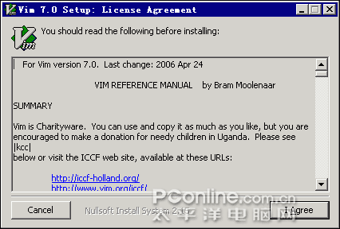  
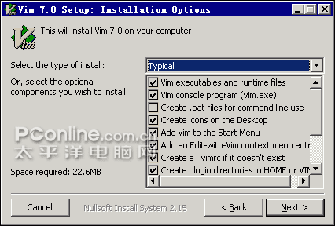  
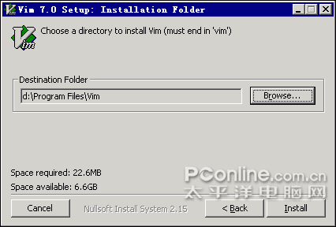  
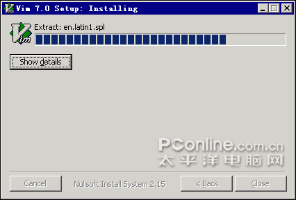  
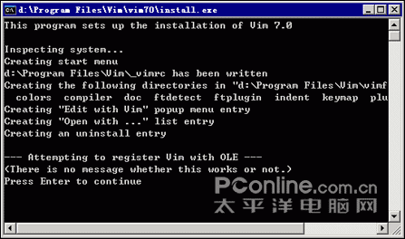  
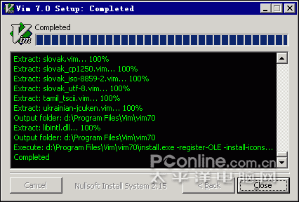  
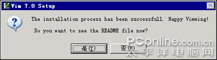

## 3 体验之旅

### 3.1 初见界面

安装完成后，按提示打开`readme`，你将看到[](http://photo.blog.sina.com.cn/showpic.html#blogid=46dac66f010005kw&url=http://album.sina.com.cn/pic/001irQirzy6J9OPA5Dw36)

或自行打开桌面的快捷方式，也可直接运行`d:\program files\Vim\Vim70\gVim.exe`，你应该看到如此界面：[](http://photo.blog.sina.com.cn/showpic.html#blogid=46dac66f010005kw&url=http://album.sina.com.cn/pic/001irQirzy6J9OSKiNmac)

什么？难看？土？我第一次见到它也是这种感觉，现在却只觉得亲切。

再一点，你有没有奇怪它是中文界面？难道我给你下载的是汉化版？会不会捆绑流氓插件啊？你如果真这样想，我只能叹息无语了。

### 3.2 试读`html`

请把此网页保存为`htm`，比如`test.htm`，然后用`Vim`打开它。暂时用菜单吧！结果可能是这样：

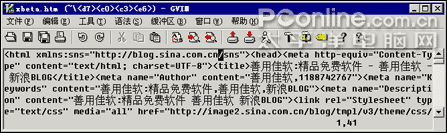

平平无奇，是吧？因为它是一个标准的`Vim`，并且是性能优先，视效忽略的`Vim`。无妨，请进入命令行模式（就是按一下冒号，注意是英文冒号`:`），注意到最下面一行的变化了吧。再输入`sy on`再回车。是不是有颜色了？它应该看起来象这个样子


重要提醒：为简化起见，下文将用`:sy on`表示（先确认在`Normal`模式，如不确认，请按几次`Esc`）你先按`:`进入命令行模式，再输入`sy on`，再回车。

补充说明：`sy`表示语法加亮，`on`当然是打开。`:sy clear`表示取消加亮。

### 3.3 改头换面

体验`Vim`就要按`Vim`的思路，所以我们要把`gVim`改回`Vim`的本来面目。

对了，如果你认为它的界面很土，请更要多看一眼当前的样子，因为下面的操作后可能会更土！

执行如下命令`:set go=`，这时的`Vim`应该是

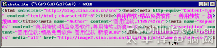  

不要大惊小怪，不就是菜单和工具栏不见了嘛？`Vim`中是不应该用到它们的。

补充说明：`set`表示一般性设置；`go`是`gui option`的缩写，就是界面；等于空就是什么都没有

再输入半条命令（先不要回车）`:colo ev`，然后，按一下`tab`键。是不是自动补全为`evening`了？`Vim`是非常聪明的（但是不会象`MS Word`那样自做聪明）。

然后你回车，看到了什么？

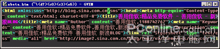

天色全黑了？没错，现在是`evening`嘛。

补充说明：`colo`就是设置调色方案。`Vim`自带了近十种调色方案，当然你还可以在网上下载更多，或改编自己的调色方案。你可以直接在`:colo` （加一个空格）就连续`tab`，选择不同的配色方案来体验一下。当然，`evening`是比较经典的一种。我一直就用它。

### 3.4 准备并打开范例文件

简化起见，请[下载`test.txt`](editor-for-mortal-images/test.txt)并保存为`d:\test.txt`。然后，在`Vim`中输入半条命令`:tabnew d:\t`，输到这里后不要回车，按一下`tab`，`Vim`会自动补全为`test.txt`的。如果不对，再按几次`tab`，直到正确为止。然后回车。


你会看到`Vim`打开了`test.txt`，并且是以多页签（`tab page`）的方式。你可以点击各页签在打开的文件中间切换（高手有更方便的键盘命令做法）。在`Vim6.3`中，还没有此功能。当然了，这并不意味着`Vim`的用户没办法享受多页签的便利，下载一个插件后——`Vim`有上千个插件——就可以了。面对多页签风格的流行（`IE6` => `Maxthon` => `IE7`），`Vim7.0`也新增了此功能。

我喜欢这种简单的页签。如果你认为此页签太难看，可试一下`:set go=e`，这时应如下效果

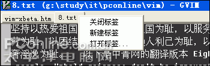

### 3.5 统一格式，修改`vimrc`

上面所操作的各种命令，都是对`Vim`的设置。把它们写到一个`_Vimrc`文件中就成了默认选项。每个`Vim`用户的`_Vimrc`文件都不一样，因为每个人的需求不同。

为了保证下面的操作得到预期的效果，请使用善用佳软提供的`_Vimrc`（附1）。依次执行下述操作：

1. 关闭所有的`Vim`
1. 找到你的`d:\program files\Vim\Vim7\_vimrc`，复制一份存档。
1. 用任意文本编辑器（`Vim`或记事本）打开`_vimrc`，用本文附1的内容替换它，并保存。
1. 重启`Vim`。

注：这并不是标准做法，但对`windows`用户是比较方便的做法。

### 3.6 打开`test.txt`

再次就模式进行提醒：`Esc`到`Normal`；`Normal`下`i`到编辑；`Normal`下`:`到命令行。

运行`Vim`，并在命令行执行`:e d:\test.txt`，接下来，我们把此文章排一下版。如果你认为可以手工排版，请把此文件复制到10000行再发表意见。

### 3.7 分段并保存

原文没有分段，观察一下，发现可以在『以下是……』前面加回车，于是

```vim
:%s/以下是/\r&/gc
```

输入后，界面如下

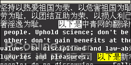  

并提示，请回答`y`或`a`。如果回答`y`，则替换当前一个；到了下一个，`Vim`还会再问你。所以，你回答几个`y`后不妨一`a`了之，全部替换。

补充说明：`s`表示替换；`s/a/b` 表示把`a`换为`b`；上一命令是把『以下是』换为`\r&`，`\r`表示回车，`&`表示被替换的部分，即『以下是』；`%`则表示全文；`/gc`表示一直替换（不是仅替换第一个），并且要用户确认。

看一下文件，你或许想，空2行可能更好。很简单，再重复一下刚才的命令就好了。不过，对强大的`Vim`来说，无须笨笨地重复输入上次的命令。在命令行按下`:`后，再按一下`↑`（向上的方向键），看到刚才的命令了吧？直接回车，提问时输入`a`，任务完成。

既有变化，请及时保存。命令是`:w`。当然，你也可以按`ctrl+s`。但`ctrl+s`之所以有效，是因为我在`_Vimrc`中做了定义：当按下`ctrl+s`时，系统执行`:w`动作。因此，你完全可以定义其他热键，并把它映射到`:w`。

### 3.8 继续编辑

首先删除『坚持』两字，很简单，只要按`gg2x`就行了。为了看效果，你可以分开按：

- `gg`，这时光标移到文章头。
- `2x`，这时删掉了2个字符。

再一次体验`Vim`的神奇，比如按`5x`，于是5个字符消失了。当然，这5个字符是要保留的，没关系，你按一次`u`，就回来了吧？

再按一下`Ctrl+r`，是不是又没了？再来一次`u`，是不是又回来了？没错。`u`和`Ctrl+r`相当于（是相当于不是等同于）`windows`的`undo`和`redo`。

再试一下`dd`。是不是整行没有了？没关系，`u`回来就行了。

再试一下`3dd`。一下子删除了3行！没关系，`u`回来。

再来一个`dG`，哇，全文都没了？！仍然`u`回来啊。

### 3.9 更多编辑

#### 任务a：把每一句分为一行，即达到如下效果

```
以**为荣、
以**为耻，
```

解决：如果你记得上面的替换命令，就会想到，可以用2次替换（『为荣、』换为『为荣、』加回车，『为耻，』换为『为耻，』加回车）。但这两次替换在`Vim`中完全可以一次完成，即用正则表达式，在『为』及后面2字符（『荣、』或『耻，』）后加入回车。怎么表示呢？

```vim
:%s/为../&\r/gc
```

看一下高亮，没问题，直接`a`


哇，是不是很壮观啊？没觉得？如果是一千行一万行呢？

#### 任务b：把行末的标点去掉，即『荣』后的顿号和『耻』后的逗号

解决：办法太多了，仍可以用替换。但此处还是展示一个新功能：列操作。

安全起见，按两下`Esc`，再`gg$`，这时光标应到了文章第一行最后一个字符，即顿号上。

再按`ctrl+v`，注意一下状态栏是否提示有『可视块』 字样。（请确认你是采用了`xbeta`的`_Vimrc`文件，如果没有，请试一下`ctrl+q`）

再`15jx`，是否标点全部删除了？因为`15j`表示向下选中15行，`x`表示删除。

#### 任务c：错落有致

操作：这次演示一下宏的用法，请严格按本教程操作。

1. 先做一下确认：输入法没有打开，并`Esc`到`normal`状态，`gg`到文首。
1. 按`qa`（`q`表示开始录制宏，宏的名字为`a`）
1. 再`shift+>>`（表示按住`shift`，连按两下`>，`再放开`shift`。此时第一行应当向后`tab`了一下）
1. 再`j^`（此时下移一行，并置光标于行首）
1. 再`shift+>>`再`shift+>>`（即第二行向后`tab`两下）
1. 再`j^`（下移一行，并将光标置于行首，为后续操作做准备）
1. 再`q`（表示宏录制结束，`Vim`会提示记录完成）
1. 这样宏录完了，可以用了。
1. 再`@a`，看到了效果了吧？宏执行了一次，即3、4行成功了。还剩下6段，但是你不用按6次`@a`，而是只要按下`6@a`就行了！！！


太神奇了！回放一下？先`u`，再来一次`6@a`。既然可以6，当然可以千千万万！

补充说明：高手使用`Vim`是千变万化的。上面的前2个操作（分行+删标点），完全可以合成一个`:%s/\(`为`.\)./\1\r/gc`；或再把第3个操作（错落有致）融合到前一个操作中。

### 3.10 自由体验

体验光标移动：请随意按几下`j`和`k`，看看反应；再多按几下`l`和`h`，看看反应；然后，当你的光标在英文时，请按几下`w`和`b`。

对了，`gVim`的每一种功能，都有无限可能，因此，你也可以在上面几个字母前加上数字，比如 `9w` `2h`，看它的反应。

体验自动补全：`i`进来吧，到目前为止还没写过字呢！为简单起见，你直接把用鼠标放到中文的下一行，我们把`Eight Do's and Eight Don'ts`输入一遍。但是，输入一个`E`，先别动！按`ctrl+p`是不是自动补全了？

体验大小写（每次操作后，都用`u`恢复原状），试一下`g~~`和`guu`和`gUU`和`g??`（`g??`后可以不按`u`，再按一次`g??`也能恢复原状）

神奇吗？这还是`Vim`功能的单个表演，真正的高手是把它们组合在一起，完成你自己独特的编辑需求。

### 3.11 体验语法高亮和折叠

此部分讲起来太复杂。如果你有其他编辑器如`UltraEdit`基础，会有助于你理解。但`Vim`在此方面的强大灵活，`UltraEdit`是难忘其项背的。

仍然是我们编辑的原文件，为简化计，请[下载`test2.txt`](http://www.pconline.com.cn/pcedu/soft/gj/photo/0610/acc/test2.txt)；[下载`tx1.vim`](http://www.pconline.com.cn/pcedu/soft/gj/photo/0610/acc/tx1.vim)并保存在`d:\program files\Vim\Vimfiles\syntax\tx1.vim`
用`Vim`打开（比如要打开`d:\test2.txt`，请在`Vim`中`:tabnew d:\test2.txt`）它。平平无奇是吗？这是因为`Vim`并不知道这个文件要加亮。键入一个命令`:setf tx1`，这就相当于告诉`Vim`此文件的类型是`tx1`，所以就按照刚下载的`tx1.vim`进行高亮和折叠。


此时你会发现`test2.txt`完全折起来了。如何打开？你可用鼠标点最左边的`+`，当然，也可以用命令`zr`或`zR`打开（`zR`打开全部；`zr`打开当前；`zM`折叠全部；`zm`折叠当前）。打开后，看到高亮效果了吧。可以对文字设定前景色、背景色、粗、斜、下划线风格。

### 3.12 加密文件

文本文件打开最快，编辑起来最容易，并且在`Vim`中查找非常方便。因此，我用它来记日记，并作为通讯录。但是安全问题怎么办呢？很简单，`Vim`本身即可加密（录然解密也要用`Vim`）。在上述打开的文件中键入`:X`（是大写`X`），`Vim`就提示你设定密码，安全起见要确认第2次。然后，保存（键入`:w`）。把`Vim`或此文件关闭，再打开时，就要输入密码了。只有你输入正确的密码，才能得到正确的文件。

## 4 我的应用

`Vim`和`Total Commander`一样，我把它们都设定为开机自动运行，其应用不可胜数。

比如说通讯录管理，我未用任何软件，就用`Vim`管理一个`address.txt`。它可以实现：快速启动（我在`Vim`中定义了书签，键入 \`A 就会打开），加密（用`Vim`的`:X`），超强搜索（无须多说），分组折叠（`fold`），`email`和电话号的高亮显示（自定义语法文件）吧。

再比如，笔者会用`Vim`来辅助`word`, `excel`, `bbs`发文，安全删除文件，制作精简的五笔词库等。具体可参见 《[我常用的`Vim`功能](http://blog.sina.com.cn/u/46dac66f010004gy)》，《[活学善用`gVim`，提高工作效率:实例篇(合集)](http://blog.sina.com.cn/u/46dac66f010002xz)》，《[用`gVim`打造个性化记事本](http://blog.sina.com.cn/u/46dac66f010002he)》等文章。

如下两图分别是我的个性化`txt`示例，和用`Vim`写此篇文章时的情况：

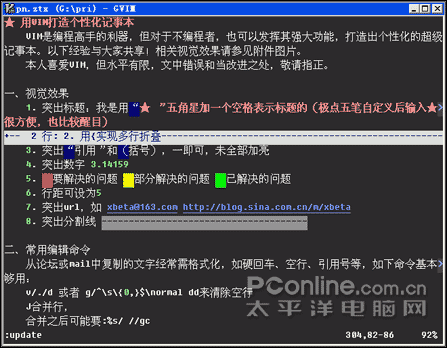

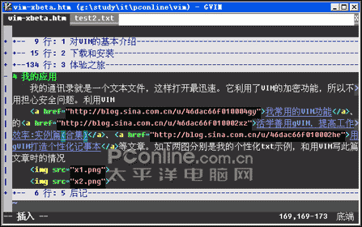

## 5 后记

这篇文章比最初计划写得长很多，但仍感觉很多非常优秀的功能没有提到。比如，眼下我写这篇文章，当然用`Vim`。但是因为有插图，所以用了`htm`格式。在插入图片时，我只要输入`img`，`Vim`会自动换为``，并把光标放到两个引号中间，以便于我输入图片名称。我输入`lnk`后，`Vim`会替换为`<a href=""></a>`。当我想看一下效果时，我只要`:! g:\study\it\pconline\Vim\xbeta-Vim.htm`它就自动在浏览器中打开了。而这一个长长的路径，因为有了自动补全和命令行历史，也非常容易。而当一些`url`还未确定，需要标注时，我就用一个 \`1 ，`Vim`就会以醒目的红色块标出来，一目了然。而下次再打开此文件，它会记得我最后编辑的位置。

在用`Vim`之前，我曾试过几十种`pad`和`editor`，包括长期用`Editpad`，也曾经比较精通过`UltraEdit`，也曾经测过`EmEditor`, `EditPlus`等。但用了`Vim`之后，我不再关心`windows`世界的成千上万的编辑器。因为使用它们的逻辑是『如果有新需求，只能等软件升级或换一个软件”，而使用`Vim`的逻辑则是『如果有新需求，请做个性化配置或下载插件”。

`Vim`在手，夫复何求！

最后，向`Vim`所代表的追求卓越、开源共享的精神致敬！并希望有责任感的用户逐渐减少盗版！（完）

## 附1：`_vimrc`文件

```vim
set nocompatible
set magic
set ru "标尺信息
set ai
set sw=4
set ts=4
set dy=lastline "显示最多行，不用@@
"以上是缩进相关
set backspace=indent,eol,start
colo evening
sy on
set go= "无菜单、工具栏
set nobackup
set hlsearch
set showmatch
"tab mappings
map 1gt
map 2gt
map 3gt
map 4gt
map 5gt
map 6gt
map 7gt
map 8gt
map 9gt
map :tabnew
map :tabclose
map! 1gt
map! 2gt
map! 3gt
map! 4gt
map! 5gt
map! 6gt
map! 7gt
map! 8gt
map! 9gt
map! :tabnew
map! :tabclose
" Use CTRL-S for saving, also in Insert mode
noremap :update
vnoremap :update
inoremap :update

"2006-09-13 如下：保存视图
au BufWinLeave *.ztx mkview
au BufWinEnter *.ztx silent loadview
au BufNewFile,BufRead *.tx1 setf tx1
```
