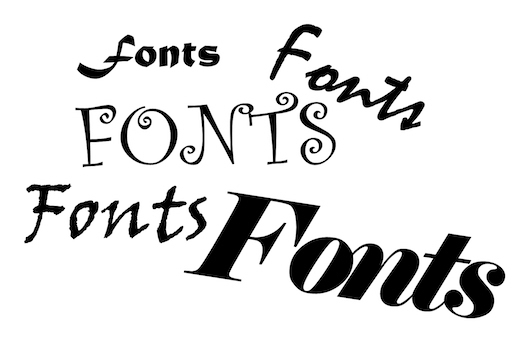
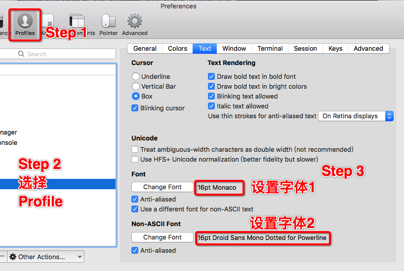
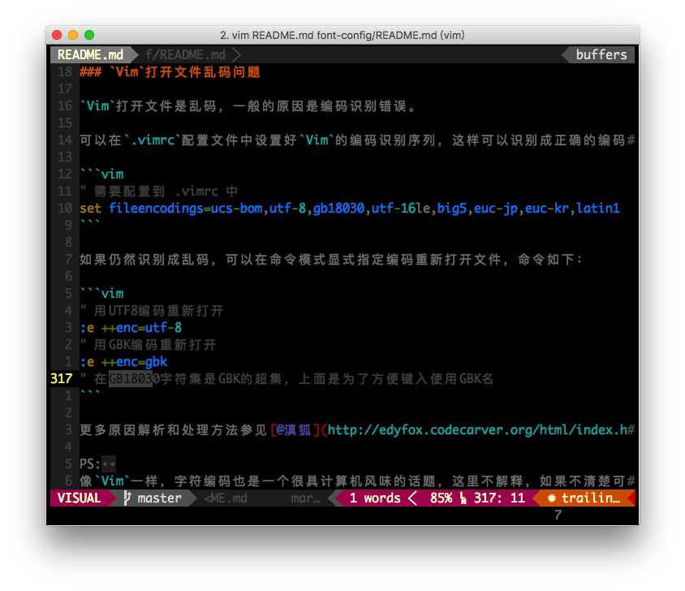
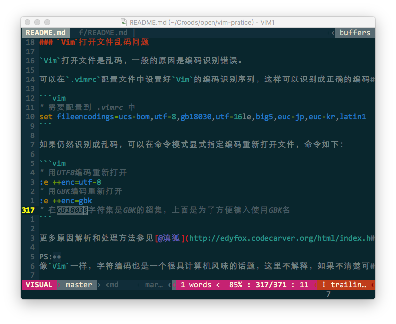

# `Vim`字体设置

<!-- START doctoc generated TOC please keep comment here to allow auto update -->
<!-- DON'T EDIT THIS SECTION, INSTEAD RE-RUN doctoc TO UPDATE -->


- [字体在哪儿配置](#%E5%AD%97%E4%BD%93%E5%9C%A8%E5%93%AA%E5%84%BF%E9%85%8D%E7%BD%AE)
- [终端下的`Vim`字体配置](#%E7%BB%88%E7%AB%AF%E4%B8%8B%E7%9A%84vim%E5%AD%97%E4%BD%93%E9%85%8D%E7%BD%AE)
    - [效果图](#%E6%95%88%E6%9E%9C%E5%9B%BE)
- [`MacVim`的字体配置](#macvim%E7%9A%84%E5%AD%97%E4%BD%93%E9%85%8D%E7%BD%AE)
    - [效果图](#%E6%95%88%E6%9E%9C%E5%9B%BE-1)
- [配置`Powerline`字体的`Vim Airline`](#%E9%85%8D%E7%BD%AEpowerline%E5%AD%97%E4%BD%93%E7%9A%84vim-airline)
    - [1.安装和配置`Airline`](#1%E5%AE%89%E8%A3%85%E5%92%8C%E9%85%8D%E7%BD%AEairline)
    - [2. 安装`Powerline`字体](#2-%E5%AE%89%E8%A3%85powerline%E5%AD%97%E4%BD%93)
    - [3. 开启`Vim Airline`的`Powerline`字体](#3-%E5%BC%80%E5%90%AFvim-airline%E7%9A%84powerline%E5%AD%97%E4%BD%93)

<!-- END doctoc generated TOC please keep comment here to allow auto update -->

合适字体可以方便识别，提高效率和心情，不能说不重要！ :kiss:

本人用的是`Mac`系统，这里说明的是`Mac`系统下配置。其它系统要关注和解决的问题类似，可以参照自行配置，如碰到问题可以搜索一下，或是提个[Issue](https://github.com/oldratlee/vim-pratice/issues)一起讨论。

# 字体在哪儿配置

- 对在控制台中运行的`Vim`命令，字体由终端配置。
- `GUI Vim`由`Vim`自己来配置。

`Mac`下，终端常用的是[`iTerm`](https://www.iterm2.com/)和系统自带的`terminal`应用，`GUI Vim`用的是[`MacVim`应用](https://github.com/macvim-dev/macvim)。

# 终端下的`Vim`字体配置

本人使用的是`Mac`下[`iTerm`](https://www.iterm2.com/)终端，相比系统自带的`terminal`终端应用有不少贴心功能。

在字体配置方面，`iTerm`可以配置多重字体，并且对字体中字符的`Fallback`处理的很不错。  
\# `Fallback`是指，如果一个字符在一种字体中没有包含时，如果找到且使用包含这个字符的字体。

推荐使用字体 **_`Monaco`_**，加上`Powerline`字体 **_`Droid Sans Mono Dotted for Powerline`_** 作为第二字体。

`iTerm`的字体配置方法如下：



本人的`iTerm`具体字体配置：第一重字体 **_`Monaco`_** 16号；第二重字体 **_`Droid Sans Mono Dotted for Powerline`_** 16号。

**_注意_**： 这里也给出了字体大小的具体说明，是因为自己在字体配置的过程中发现：  
不同的字体大小、不同具体`Powerline`字体，`Powerline`字体中的特殊字体如『左右三角、箭头』效果会有优劣…… :tired_face:

这样配置后：

1. 对于英文字符，会首先可以用苹果`Mac`系统下高质量字体  **_`Monaco`_**（当然也可以用其它你喜欢合口味的英文等宽字体）。
1. 对于`Powerline`字体中的加强字符，英文字体中没有包含，通过配置的第二重`Powerline`字体 **_`Droid Sans Mono Dotted for Powerline`_**，可以正常显示。  
    \# `Vim`的`Powerline`安装和配置，见后面一节的说明。
1. 对于其它的字体（如中文字符），`iTerm`会`Fallback`到系统的缺省字体，对于`MacOS Sierra 10.12`，选择的是 **_苹方_** 字体。  
    \# `MacVim`这一级`Fallback`就不是 **_苹方_** 字体 :weary: ，效果差！详见`MacVim`的字体配置的说明。

最终效果不错，截图如下。

## 效果图



# `MacVim`的字体配置

`MacVim`的多层字体配置，通过`Vim`的`guifont`和`guifontwide`2个选项配置。

本人的`MacVim`具体字体配置：第一重字体 **_`Consolas`_** 16号；第二重字体 **_`STXihei`_**(华文细黑) 16号。

对应在`Vim`配置文件添加：

```vim
" 配置英文字体
set guifont=Consolas:h16
" 指定宽字符的字体，如中文字符
" 实际上使用这个字体下的字符都会占用2倍的宽度
set guifontwide=STXihei:h16
```

个人在配置过程中，碰到的问题及其解决方法：

1. 本人 **_不会_** 使用`Powerline`字体作为第一字体，因为系统自带字体 **_`Monaco`_**、**_`Consolas`_** 的英文等宽字体的质量很高。
1. 使用`Powerline`字体作为`guifontwide`后，中文字符的字体在`MacVim`下显示很差，即`Fallback`的字体不好。

基于上面原因，在`MacVim`下，我放弃了`Airline`的`Powerline`字符，配置方式如下：

```vim
" 如果运行的不是GUI（即MacVim），才启用Airline的Powerline字符
if ! has('gui_running')
    let g:airline_powerline_fonts=1
endif
```

最终效果不错，截图如下。

## 效果图



# 配置`Powerline`字体的`Vim Airline`

## 1.安装和配置`Airline`

如果你使用了`Vim`配置版[`spf13-vim`](https://github.com/spf13/spf13-vim)，`Airline`已经一起安装和配置好了。

官网[vim-airline, Lean & mean status/tabline for vim that's light as air](https://github.com/vim-airline/vim-airline)，有独立的安装说明。

## 2. 安装`Powerline`字体

```bash
git clone git@github.com:powerline/fonts.git
cd fonts
./install.sh
```

更多说明详见官网 https://github.com/powerline/fonts。

## 3. 开启`Vim Airline`的`Powerline`字体

如果你使用的是[`spf13-vim`](https://github.com/spf13/spf13-vim)配置版，参见其[`Airline`一节的说明](https://github.com/spf13/spf13-vim#airline)。

官网[vim-airline, Lean & mean status/tabline for vim that's light as air](https://github.com/vim-airline/vim-airline)，有独立的配置说明。

